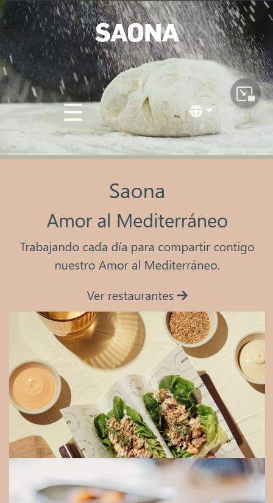
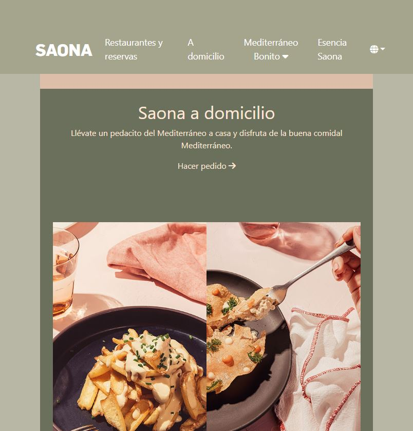

# Proyecto 2 - Carta Restaurante Digital 

##### Tabla de contenidos

- [Descripción](#descripción)
  - [El reto](#el-reto)
  - [Capturas de pantalla](#capturas-pantalla)
  - [Links](#links)
- [Mi proceso de trabajo](#mi-processo)
  - [Creado con](#creado-con)
- [Autor](#autor)
- [Licencia](#licencia)

## Descripción

### El reto

En esta entrega de proyecto de la segunda semana en el bootcamp de GeeksHubs se nos pide crear una página web de un restaurante de nuestra elección usando el framework BOOTSTRAP. Debemos incluir como mínimo una página principal con la presentación del restaurante y páginas adicionales con el menú, información de contacto, etc.

Uno de los condicionantes más importantes a la hora de diseñar la website es que ésta debe ser responsive. Debe adaptarse a pantallas de móvil así como ipads y pantallas de ordenador. Para ello hemos hecho uso de los tamaños de Bootstrap: xs para small screens menor de 576px, md para mayor o igual a 576px, y lg para pantallas mayor o igual a 992 px.

### Capturas de pantalla y detalles de las páginas creadas
|Página principal - lg|
|-|
|La página principal se compone del Header donde podemos ver un video presentación y la barra de navegación. A continuación se divide en otras 3 secciones y finaliza con el footer. Las imágenes aumentan de tamaño cuando pasas el ratón por encima creando un dinamismo a la página para hacerla más interesante. También cuando pasas el ratón por los links: Ver restaurante, Hacer pedido y Saber más, la flechita se mueve hacia la derecha. El fondo de la barra de navegación cambia de transparente a color cuando hacemos scroll más allá del video header para facilitar la lectura en el resto de la página.|
||

|Página principal - xs| Página principal - md|
|-|-|
|En small screens los links se esconden, apareciendo un icono botón que al apretar que despliega sólo: Restaurantes y reservas, A domicilio y Esencia Saona. El logo Saona se coloca en medio en primera linea, y en segunda los dos iconos. Las imágenes se colocan en columna y el fondo de éstas ocupa el ancho completo|En tamaño para ipad, los elementos van ajustandose en tamaño. Algunas veces se escalan otras se colocan en una mejor disposición en su espacio, manteniendo las proporciones y sin colapsar o montarse unos encima de otros. Todavía podemos ver el navbar totalmente desplegado como en pantallas más grandes, pero sin espacio entre los links y completamente centrados|
|||

|Página de los restaurantes|
|-|
|En esta página podemos ver una selección de restaurantes de la compañia, con links a la ficha de información de cada uno (Ver restaurante), y link a google maps de su ubicación (Cómo llegar). Todavía no hemos creado página de reservas.|
||

|Página de Saona Gran Vía|Página de Saona Alameda|Página de Saona La Virgen|
|-|-|-|
||||

|Ejemplo página con la información de cada restaurante|
|-|
|Aquí podemos ver un carousel con las fotos del local en particular. Un botón que pone CARTA que nos lleva al menú del restaurante. Links de Cómo llegar que nos lleva a Google Maps, y Pedir a domicilio con Glovo, que nos lleva a la página de Glovo. Además añadimos la info del restaurante, un calendario para la fecha de reserva que todavía no está funcional y un mapa interactivo de Google maps.|
||

|Página con el menú del día|
|-|
|En esta página la primera sección es una presentación con dos imagenes de cabezera.|
|A continuación una lista de platos para picar con sus precios. Los apuntes en letra más pequeña desaparecen en small screens y el tamaño de las palabras más grandes se reduce para caber perfectamente en el formato móvil.|
|Las dos secciones siguientes son los entrantes y principales. Los primeros con un carousel y los siguientes con los elementos card, ambos del boostrap. Las card se distribuyen 4 en linea en tamaño lg, 2 en tamaño md y 1 en xs|
||

|Páginas en construcción.|
|-|
|Por último, aunque no menos importante. Todas los links que no contienen una página todavía nos dirigirán a la página de la siguiente captura que indica que la página está todavía en construcción. He añadido el navbar y el footer para que el usuario pueda volver fácilmente a las demás páginas que sí funcionan.|
||

### Links

- [Website del restaurante](https://ramonfolguera.github.io/rfc-geekshubs-fsd-val-proyecto2-26012023/)
- [index.html](https://github.com/RamonFolguera/rfc-geekshubs-fsd-val-proyecto2-26012023/blob/master/index.html)
- [menu.html](https://github.com/RamonFolguera/rfc-geekshubs-fsd-val-proyecto2-26012023/blob/master/pages/menu.html)
- [Archivo principal CSS](https://github.com/RamonFolguera/rfc-geekshubs-fsd-val-proyecto2-26012023/blob/master/css/style.css)

## Mi proceso de trabajo

### Creado con

- HTML5
- CSS propiedades customizadas
- BOOTSTRAP 
- Mobile-first 
- JavaScript (Para el accionamiento del botón del navbar y la aparición del background haciendo scroll)

### Autor

- Ramón Folguera Carbonell
- Twitter - [@folgueramon](https://twitter.com/Folgueramon)

### Licencia

Este proyecto está creado bajo una licencia MIT License. Véase el archivo LICENSE.md para más detalles.

